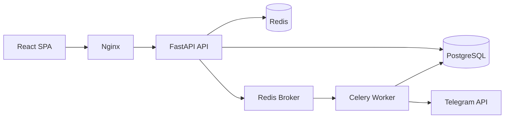

# SmartTender — жүйе архитектурасы

## Архитектуралық шешім

**Modular Monolith** — бір репозиторий, модульдік құрылым, кейін микросервиске бөлуге дайын.

## Docker қызметтері (1-2 апта)

| Қызмет | Контейнер | Мақсаты |
|--------|-----------|---------|
| API | smarttender_api | HTTP, JWT, CRUD |
| DB | smarttender_db | PostgreSQL 16 |
| Cache | smarttender_redis | Кэш + Celery broker |
| Worker | smarttender_worker | Фон тапсырмалар (3-апта) |
| Beat | smarttender_beat | Cron (3-апта) |

## Модульдер

- `app/api/auth` — JWT login/register/refresh
- `app/api/tenders` — тендер CRUD + Redis кэш
- `app/api/proposals` — жеткізуші ұсыныстары
- `app/api/categories` — анықтамалық + кэш
- `app/api/departments` — бөлімдер
- `app/core` — security, RBAC, cache

## Redis кэш стратегиясы (2-апта)

| Дерек | Key | TTL |
|-------|-----|-----|
| Тендерлер тізімі | `tenders:active:page:{n}:status:{s}` | 5 мин |
| Санаттар | `categories:all` | 1 сағат |
| Сессия | `session:{user_id}` | 15 мин |

API жауабында `X-Cache: HIT|MISS` заголовғы кэш әсерін көрсетеді.

## RBAC рөлдері

`superadmin`, `procurement_manager`, `department_head`, `employee`, `supplier`

## Дерекқор (негізгі кестелер)

`users`, `departments`, `categories`, `tenders`, `tender_proposals`

Индекстер: `tenders(status, deadline)`, `tender_proposals(tender_id, supplier_id)`, `users(email)`.
